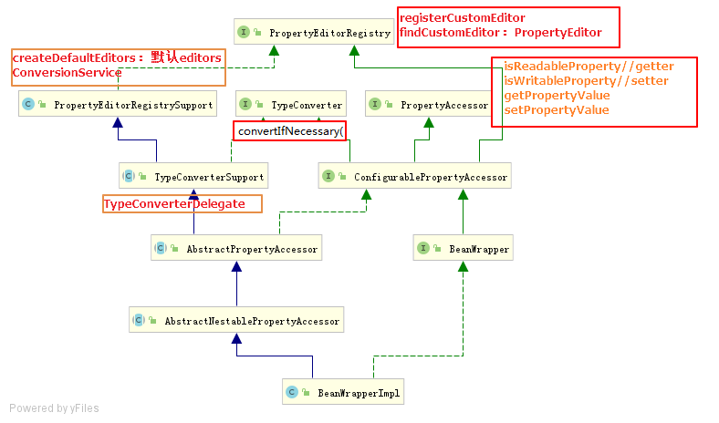
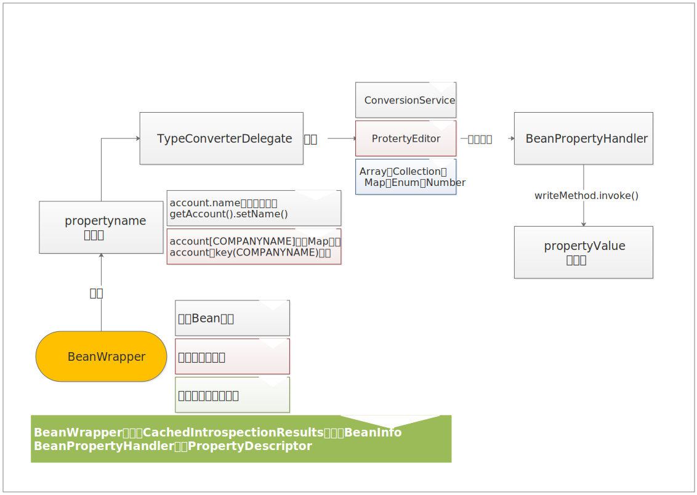
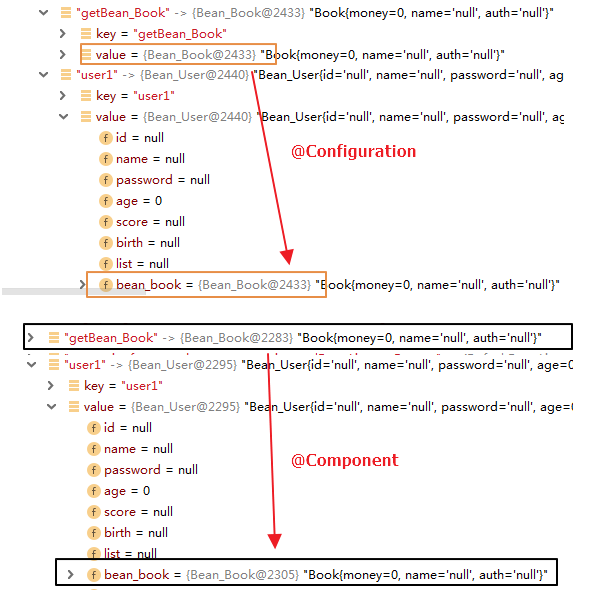

## JDK

### JAVABean规范

---

1. 类必须使用public修饰

2. 必须提供无参构造函数

3. 属性值必须为private

4. 提供public的getter和 setter方法设置属性值

5. 实现serializable接口

#### java.beans.*

#####     重要接口及类

| 类或接口名称          | 类型      | 作用                                                         |
| --------------------- | --------- | ------------------------------------------------------------ |
| Introspector          | class     | 通过**反射**封装Bean的信息到BeanInfo                         |
| BeanInfo              | class     | 封装属性名及其getter/setter名称，方法等等信息                |
| PropertyDescriptor    | class     | 属性描述符                                                   |
| PropertyEditor        | interface | 设置属性值时，需要将字符串转为相应的数据类型。JDK默认只提供基础类型比如boolean、long，string等 |
| PropertyEditorManager | class     | 管理/注册/提供PropertyEditor。                               |

#### 代码示例

```java
  BeanInfo beanInfo = Introspector.getBeanInfo(Bean_User.class);
 //获取属性描述符
  PropertyDescriptor[] propertyDescriptors = beanInfo.getPropertyDescriptors();
  //bean实例
	Bean_User bean_user =new Bean_User();
	//调用PropertyEditor设置属性值
Arrays.stream(propertyDescriptors).forEach(descriptor->{
            if(descriptor.getName().equals("age")){//注意basename和name区别
                System.out.println("修改 age");
                Method writeMethod = descriptor.getWriteMethod();
                //注意只有基础类型比如int、long、boolean、string等，没有date
                PropertyEditor editor = PropertyEditorManager.findEditor(
                    descriptor.getPropertyType());
                editor.setAsText("55");
                try {
                    writeMethod.invoke(bean_user,editor.getValue());
                } catch (Exception e) {
                }
			}
}
```

#### 示意图


#### 问题

1. 原生JAVA的PropertyEditor不足之处：

   - 只能用于字符串到Java对象的转换，不能进行任意两个Java类型之间的转换。
   - 对上下文不敏感（如注解、类结构），因此不能利用上下文信息进行高级的转换逻辑。

   * spring希望**org.springframework.core.convert**可以替换原生JAVA体系，但历史原因保留两种支持，后文在具体分析。

   * Spring 3后，Spring提供了统一的ConversionService API和强类型的Converter SPI，以实现转换逻辑。

   - 通用的core.convert Converter SPI不能直接完成格式化需求。基于此，Spring 3 引入了 Formatter SPI，相比PropertyEditors简单直接。

   * ConversionService 为Converter SPI和Formatter SPI提供了统一的 API。

### BeanWrapper

---




根据第一部分的理解也能只能，beanwrapper其实是对上述**设置属性值**的封装：

1. Bean实例包裹器；

2. 属性访问器；

3. 属性编辑器注册表。

beanwrapper处理复杂的设置属性的逻辑，如属性名的嵌套、list、set、map、array等
	`getPropertyValue`和`setPropertyValue`是分别用于获取和设置bean的属性值的。这里的propertyName支持表达式：

| 表达式                 | 说明                                                         |
| ---------------------- | ------------------------------------------------------------ |
| `name`                 | 指向属性name，与getName() 或 isName() 和 setName()相对应。   |
| `account.name`         | 指向属性account的嵌套属性name，与之对应的是getAccount().setName()和getAccount().getName() |
| `account[2]`           | 指向索引属性account的第三个元素，索引属性可能是一个数组（array），列表（list）或其它天然有序的容器。 |
| `account[COMPANYNAME]` | 指向一个Map实体account中以COMPANYNAME作为键值（key）所对应的值 |

#### 示例

```java
    @Test
    public void testNestableProperty(){
        Bean_User bean_user = Bean_User.getDefaultBean_user();
        System.out.println("修改前："+ReflectionToStringBuilder.toString(bean_user));
        BeanWrapper beanWrapper = PropertyAccessorFactory.forBeanPropertyAccess(bean_user);
        beanWrapper.setPropertyValue("bean_book.name","嵌套属性");
        beanWrapper.setPropertyValue("list[0].name","list嵌套属性");
        System.out.println("修改后："+ReflectionToStringBuilder.toString(bean_user));
    }
    //-------------------------Bean属性-------------------------------------//
    public static Bean_User getDefaultBean_user(){
        ArrayList<Bean_Book> bean_bookList = new ArrayList<>();
        Bean_Book bean_book = new Bean_Book();
        bean_book.setAuth("beanbook");
        bean_book.setName("helloworld");
        bean_bookList.add(bean_book);
        Bean_Book bean_book2 = new Bean_Book();
        bean_book2.setAuth("beanbook2");
        bean_book2.setName("helloworld2");
        //-----------
        Bean_User bean_user = new Bean_User();
        bean_user.setAge(20);
        bean_user.setBirth(Date.from(LocalDateTime.now().toInstant(ZoneOffset.UTC)));
        bean_user.setId("froggengo");
        bean_user.setList(bean_bookList);
        bean_user.setName("froggenname");
        bean_user.setPassword("123456");
        bean_user.setScore(100);
        bean_user.setBean_book(bean_book2);
        return bean_user;
    }
```

1. **找**：如`property1.property2.property3`结构的数据，依赖`AbstractNestablePropertyAccessor`循环截取点符号“.”前的属性名，通过getmethod反射获取属性值value，循环获取当前对象对应下一个点符号“.”前的属性名对应的值，直到没有下一个，则设置value值。复杂在循环解析属性名，还要区分set、list、map等类型
2. **设置**：解析得到最后一个propertyDescript后，需要判断时说明属性类型类型，找相应的属性类型转换器，propertEditor、ConversionService

#### 流程图



#### 数据转换

##### 接口图


##### 注册


1. @InitBinder

2. ConversionService

3. WebBindingInitializer

4. https://www.javatt.com/p/33050

### 资源

---

1. [Spring框架的技术内幕](https://www.iteye.com/topic/1123081)
2. 

## SpringCore：[官网](https://docs.spring.io/spring/docs/current/spring-framework-reference/core.html#)

---

### 生命周期

---

* 实现接口`InitializingBean`和`DisposableBean`，对应`afterPropertiesSet()`和`destory()`
  * 接口产生耦合，不推荐，但Spring框架多处使用到
* 方法上声明JSR250注解`@PostConstruct`和`@PreDestory`

* @Bean中属性显示给出`init-method`和`destory-method`
* 默认的方法名称：`init(), initialize(), dispose()  `

1. `initialization callback`  在完成所有依赖注入后马上执行，即AOP前
2. `initialization callback`调用顺序
   1. Methods annotated with `@PostConstruct`
   2.  afterPropertiesSet() as defined by the`InitializingBean` callback interface
   3. A custom configured `init()` method  
   4. 

3. `Destruction callbacks  `调用顺序
   1. Methods annotated with `@PreDestroy`
   2. destroy() as defined by the `DisposableBean` callback interface
   3.  A custom configured `destroy()` method  

#### 相关Aware接口

1. ApplicationContextAware 
2. BeanNameAware 
3. BeanFactoryAware
4. MessageSourceAware
5. ResourceLoaderAware
6. ServletConfigAware
7. ServletContextAware
8. 等  

### 注解开发

**`@Autowired, @Inject, @Resource, and @Value  `由`Spring的BeanPostProcessor  `处理**

#### @Require： 

* `bean property setter methods`
* 必须完成设置的property值，否则NullPointerException

#### @Autowired： 

* `field、method with aribitary  name and arguements`

* `type-driven injection`  
* 推荐使用属性`required=true`，代替`@Require`
* 可以为Bean注入已知的Bean：`BeanFactory, ApplicationContext, Environment, ResourceLoader,ApplicationEventPublisher, and MessageSource`

#### @Order or  @Priority  

* `@Autowired`首先注入标记`@Priority`的Bean

#### @Qualifier  

* 配合`@Autowired`,注入`@Qualifier`指定名称的Bean`创建时声明name`，

#### @Resource   

* 只能使用在变量、property setter methods
* `by-name  injection`
* 没有指定name属性，则`by-type`

#### @PostConstruct and @PreDestroy  

#### @Scope

#### @Lazy  

#### @Value 

* `@Value("#{privateInstance.age}")`为参数注入privateInstance的age值

#### **@Description**

#### @Profile

#### @PropertySource 


### component管理

#### @Configuration, 

#### @Component、@ComponentScan、@ImportResource @Import  

#### @Repository, @Service, and @Controller  

#### @Bean(value、initMethod ,destroyMethod )

* Bean注解在方法上，入参会自动注入

#### 


#### Meta-annotations  将一个注解标注在另一个注解上

```java
@Component // Spring will see this and treat @Service in the same way as @Component
public @interface Service {
}

@Scope(WebApplicationContext.SCOPE_SESSION)
public @interface SessionScope {
    /**
    * Alias for {@link Scope#proxyMode}.
    * <p>Defaults to {@link ScopedProxyMode#TARGET_CLASS}.
    */
    @AliasFor(annotation = Scope.class)
    ScopedProxyMode proxyMode() default ScopedProxyMode.TARGET_CLASS;
}    
```

#### @Component,@Repository, @Service,@Controller  

```java
@Configuration
@ComponentScan(basePackages = "org.example",
    includeFilters = @Filter(type = FilterType.REGEX, pattern = ".*Stub.*Repository"),
    excludeFilters = @Filter(Repository.class))
public class AppConfig {
...
}
```

#### @Component和@Configuration区别

[参考Spring @Configuration和@Component的区别](https://www.jb51.net/article/153430.htm)

```java
 @Component
public @interface Configuration {
	@AliasFor(annotation = Component.class)
	String value() default "";
}
```

从定义来看，`@Configuration `注解本质上还是`@Component`， `@ComponentScan`都能处理`@Configuration`注解的类。

##### 示例

1. 配置类

```java
@Configuration//@Component
public class myConfiguration {

    @Bean
    public Bean_Book getBean_Book(){
        System.out.println("创建一个Book");
        return new Bean_Book();
    }
    @Bean(name="user1")
    public Bean_User getBean_User(){
        Bean_User bean_user = new Bean_User();
        bean_user.setBean_book(getBean_Book());
        return bean_user;
    }
}
```

2. 启动类

   ```java
   public class BeanDefinetionLearn {
       @Test
       public void DifBetweenConfigurationAndComent(){
           AnnotationConfigApplicationContext applicationContext = new AnnotationConfigApplicationContext();
           applicationContext.scan("com.froggengo.springlearn.apractice.a_bean.a_beandefinition.other.testConfiguration");
           applicationContext.refresh();
           Object user1 = applicationContext.getBean("user1");
           Object getBean_book = applicationContext.getBean("getBean_Book");
           Object getBean_book1 = applicationContext.getBean("getBean_Book");
           if (getBean_book ==getBean_book1){
               System.out.println("相同");
           }else{
               System.out.println("不相同");
           }
       }
   }
   ```

3. 输出：

   ```
   //@Configuration
   创建一个Book
   相同
   //@Component
   创建一个Book
   创建一个Book
   相同
   ```

4. 分析 

   ***@Configuration 中所有带 @Bean 注解的方法都会被动态代理，因此调用该方法返回的都是同一个实例。***

   ***@Component中的@Bean并不被CGLIB代理，但并不是每次都返回新的对象，有些文章写每次都返回新对象是不正确的***。应该是`bean_user.setBean_book(getBean_Book());`，在解析的过程中，``getBean_Book()``会作为java原义解析，而不会注入当前已经实例的Bean

   ```markdown
   The `@Bean` methods in a regular Spring component are processed differently than their counterparts inside a Spring `@Configuration` class. The difference is that `@Component` classes are not enhanced with CGLIB to intercept the invocation of methods and fields. CGLIB proxying is the means by which invoking methods or fields within `@Bean` methods in @Configuration classes creates bean metadata
   references to collaborating objects; **such methods are not invoked with normal Java semantics but rather go through the container in order to provide the usual lifecycle management and proxying of Spring beans even when referring to other beans via programmatic calls to `@Bean` methods.** In contrast, invoking a method or field in an `@Bean` method within a plain `@Component` class has standard Java semantics, with no special CGLIB processing or other constraints applying. 
   ```

   [Spring Reference](https://docs.spring.io/spring/docs/current/spring-framework-reference/core.html#beans-factorybeans-annotations) 单独一章说明**Defining bean metadata within components **,从上文也可以看出，**@Component **中@Bean如果调用了其他方法，如示例中`bean_user.setBean_book(getBean_Book())`并不会再**container**中找相应的Bean，而是作为`standard Java semantics`就像正常的java代码一样执行

5. Debug，参考applicationcontext中Beanfactory的SingleBean

   

### BeanFactory和ApplicationContext区别

| Feature                                                     | `BeanFactory` | `ApplicationContext` |
| :---------------------------------------------------------- | :------------ | :------------------- |
| **Bean instantiation/wiring**                               | Yes           | Yes                  |
| Integrated lifecycle management                             | No            | Yes                  |
| Automatic **`BeanPostProcessor`** registration              | No            | Yes                  |
| Automatic **`BeanFactoryPostProcessor`** registration       | No            | Yes                  |
| Convenient **`MessageSource`** access (for internalization) | No            | Yes                  |
| Built-in **`ApplicationEvent`** publication mechanism       | No            | Yes                  |

### 相关接口和注解

#### BeanFactoryPostProcessor  配合Ordered  ：

* customing configuration metadata，即修改实例化前的元信息
  * PropertyOverrideConfigurer  
  * PropertyPlaceholderConfigurer  

#### BeanPostProcessor 

* customing Beans Instances，即修改实例化后Bean的信息
* `CommonAnnotationBeanPostProcessor ` :识别`@Resource`和`JSR-250 lifecycle annotations`
* `AutowiredAnnotationBeanPostProcessor`

#### FactoryBean\<T\>

* 一般复杂的Bean初始化使用该方式，ioc容器调用`getObject()`返回实例对象
* `applicationContext.getBean('&factoryBeanName')`返回factory本身


